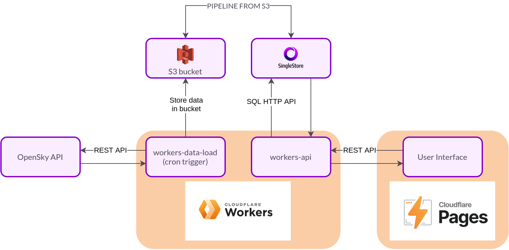

# Flight Visualizer Serverless

SingleStore Hackathon project from July 2021.

This repository is a web app that shows current and past flight data in the world. It was built by using serverless technology with Cloudflare Workers and SingleStore. Read [our blog post](www.google.com) for more information. Built by:

- [David Gomes](https://github.com/davidgomes)
- [Lídia Custódio](https://github.com/lidiagc)

## Architecture Overview

- Cloudflare Worker with cron trigger to upload flight data from OpenSky API to S3 bucket
- Cloudflare Worker with API to fetch data from SingleStore cluster using SQL HTTP API
- Cloudflare Pages to serve the frontend

## Application

Our application is [still running live](https://singlestore-planes-reference-architecture-cloudflare-worke.pages.dev/)!

## Contributing

If you want to contribute to the project please leave an issue and we'll try and help you.